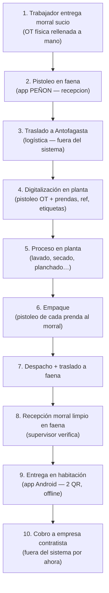
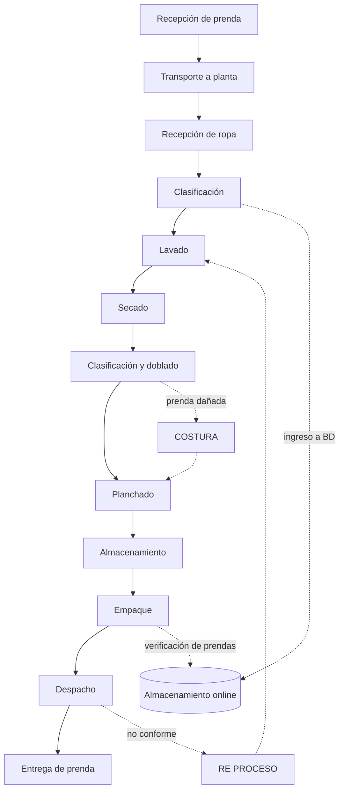
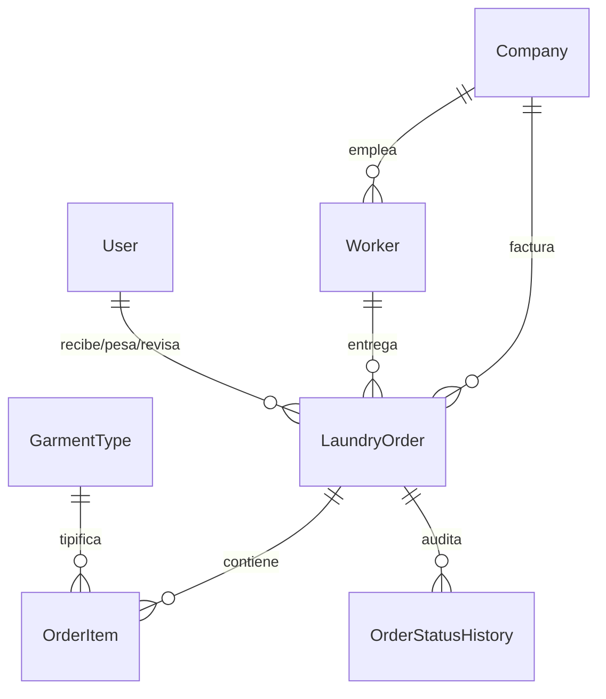

# Flujo de negocio: Servilion (lavandería industrial)

Este documento describe el **flujo operativo real** del negocio. La versión anterior se había inferido solo del análisis de `ejemplo_db_penon.mdb`; esta versión incorpora la descripción paso a paso documentada en `DB_ACCESS_CONTEXT.MD`, evidencia visual de la operación en faena/planta, y se complementa con el backend implementado en este repo.

**Fuente de verdad del flujo:** `DB_ACCESS_CONTEXT.MD`  
**Referencia de datos legados:** `ejemplo_db_penon.mdb` (operación real: **El Peñón**, faena minera)

---

## 1. Quiénes participan

| Actor | Qué es | Modelo en el backend |
|---|---|---|
| **Servilion** | La empresa que opera la lavandería (dueña de este sistema). | — (implícito) |
| **Empresa contratista/mandante** | Cliente de Servilion. Tiene trabajadores en la faena cuya ropa se lava. Ej: SODEXO PEÑÓN, METSO OUTOTEC, ORICA, MASTER DRILLING. | `companies.Company` |
| **Trabajador** | Empleado de una empresa contratista. Entrega y recibe su ropa en un **morral**. Vive en un campamento/módulo de la faena. **No es usuario del sistema.** | `workers.Worker` |
| **Supervisor Servilion en faena** | Recibe los morrales sucios del trabajador, coordina el traslado a Antofagasta y, al regreso, verifica la recepción de ropa limpia. | `authentication.User` (rol `SUPERVISOR`) |
| **Operador en faena (app PEÑON)** | Pistolea recepciones y entregas en campamento. Pantalla con contadores de entregados/despachados. | App de faena → sync con backend |
| **Staff de lavandería (Antofagasta)** | Digitaliza la OT, pistolea prendas, revisa, pesa, empaqueta y valida el morral antes del despacho. | `authentication.User` (roles `RECEPCION`, `LAVANDERIA`, `DESPACHO`, `ADMIN`) |
| **Repartidor en faena (app Android)** | Entrega el morral limpio al trabajador en su habitación escaneando QR. Opera offline. | App móvil → sync con backend |

La confusión más grande del sistema legado es que la tabla `usuarios` de Access mezclaba trabajadores (clientes del servicio) con lo que debería ser el registro de staff. En el modelo nuevo estos dos roles están separados a propósito.

---

## 2. Dos modalidades de contrato

No todos los clientes operan igual. El sistema debe contemplar **dos flujos**:

| Flujo | Descripción | Seguimiento de entrega |
|---|---|---|
| **Flujo 1** | Contratos con **entrega en habitación** | Sí — la app Android registra la entrega al trabajador |
| **Flujo 2** | Contratos con **entrega solo al cliente** | No — el morral se entrega al mandante sin trazabilidad de entrega individual |

El detalle operativo documentado hoy corresponde al **Flujo 1**. El Flujo 2 omite los pasos de recepción/entrega en habitación vía app.

---

## 3. El objeto central: la guía / OT (`LaundryOrder`)

Cada morral de ropa que un trabajador entrega genera una **guía** (`ot` en Access, `order_number` en el nuevo sistema). La guía es la unidad de trabajo desde que la ropa entra sucia hasta que se cobra.

### 3.1 Qué lleva una guía

- Un trabajador (`worker`) y, a través de él, una empresa (`company`).
- Datos del trabajador denormalizados en Access (`patio`, `pieza`, `cargo`, `turno`, `telefono`) — en el modelo nuevo viven en `workers.Worker`.
- Detalle de prendas (`items`): qué prendas y cuántas. En Access era texto libre (`"1 BOLSO+2 PANTALÓN MEZCLILLA"`); en el nuevo modelo son filas `OrderItem`.
- Peso total del morral (`peso` / `weight_kg`) — **no se pesa prenda por prenda**, solo el morral completo.
- Código interno corto `ref` (ej. `P1238`, `U2181`): reemplazo práctico del número de OT largo. Se imprime en etiquetas lavables pegadas a cada prenda.
- Observaciones de discrepancia (`observacion`): prendas faltantes o sobrantes respecto a lo declarado en la OT física.

### 3.2 Documentos físicos que acompañan la guía

La operación real maneja **dos artefactos distintos** además de las etiquetas en la ropa:

#### OT física (orden de trabajo en blanco)

Formulario impreso **"ORDEN DE TRABAJO ROPA INDUSTRIAL"** que el trabajador rellena a mano al entregar ropa sucia. Contiene:

| Sección | Campos visibles | Equivalente en sistema |
|---|---|---|
| Encabezado | Nº OT (ej. `0512177`), referencia manuscrita (ej. `#382`) | `order_number`, posible `reference` provisional |
| Trabajador | Nombre, RUT, área, habitación, patio, empresa | `workers.Worker` |
| Fechas | Fecha recepción, fecha retiro tentativa | `recepcion`, `entrega` / `promised_at` |
| Detalle | Tabla preimpresa de tipos de prenda + cantidad; el trabajador puede agregar ítems no listados (ej. *toalla café*, *bolso*) y corregir totales a mano | `orders_orderitem[]` |
| Adhesivo | Etiqueta con código de barras/QR pegada al formulario | Pistoleo en faena (`recepcion`) |

La OT física es la **fuente de verdad del trabajador** hasta que Antofagasta la digitaliza y la contrasta prenda por prenda.

#### Boleta / ticket impreso (post-lavado)

Comprobante que se genera al terminar el proceso en planta y acompaña la ropa limpia de vuelta a faena. Ejemplo real:

| Campo en boleta | Ejemplo | Campo Access / backend |
|---|---|---|
| Nº O/T | `516393` | `ot` / `order_number` |
| Referencia corta | `U2181` | `ref` / `reference` |
| Peso | `5,7 Kgs` | `peso` / `weight_kg` |
| Entrega tentativa | `20-07-2026` | `entrega` / `promised_at` |
| Empresa | METSO OUTOTEC | `empresa` / `company_id` |
| Módulo / patio | `2322` | `patio` / `camp` |
| Habitación / pieza | `OUTOTEC` | `pieza` / `room` |
| Turno | `7X7` | `turno` / `shift` |
| RUT | `17.972.169-4` | `rut` / `national_id` |
| Código control | `07606401` | `control` |
| QR + código de barras grande | RUT sin puntos (`179721694`) | Usado en pistoleo de entrega |

> **Hipótesis documentada:** `ticket` en Access probablemente corresponde a esta boleta impresa; `control` al número de control impreso en ella (ej. `07606401`). Pendiente confirmación con negocio.

### 3.3 Campos clave y su significado real

| Campo Access | Significado operativo | Campo nuevo / notas |
|---|---|---|
| `ot` | Número de OT (identificador principal de la guía) | `order_number` |
| `ref` | Código interno corto (inicial de faena/empresa + correlativo semanal desde 1000) | `reference` — generado al digitalizar en Antofagasta; va en etiquetas lavables y en la boleta |
| `recepcion` | Fecha en que se recibe la ropa **sucia en faena** (pistoleo con código de barras) | Timestamp dedicado en faena |
| `rlavanderia` | Fecha en que se recibe la ropa **sucia en lavandería** Antofagasta (pistoleo) | Timestamp dedicado en planta |
| `entrega` | Fecha **tentativa** de entrega, calculada por el sistema según el turno del trabajador | `promised_at` — impresa en la boleta |
| `entregado` | Fecha **real** de entrega al trabajador en su habitación (app Android, escaneo de 2 QR) | `delivered_at` |
| `prendas` | Cantidad total de prendas | Derivado de `OrderItem`; no debería ser columna propia |
| `peso` | Peso total del morral | `weight_kg` — impreso en la boleta |
| `observacion` | Discrepancias al corroborar la OT física vs. lo pistoleado | `observations` |
| `item` | Detalle de prendas de la OT | `orders_orderitem[]` |
| `digitadopor` | Staff que ingresa la OT al llegar a Antofagasta | `received_by` |
| `revisadopor` | Staff que revisa al llegar a Antofagasta | `reviewed_by` |
| `status` | Estado del flujo | `status` (enum §6) |
| `ticket` | Boleta impresa post-lavado (hipótesis) | Por confirmar — posible `ticket_number` |
| `control` | Número de control en la boleta (ej. `07606401`) | `control_code` |
| `imagen`, `codigo` | Significado pendiente de confirmar | Por definir |

---

## 4. Flujo 1 — paso a paso (operación real)

### Paso 1 — Entrega del trabajador en faena

El trabajador entrega un **morral con ropa sucia** acompañado de una **OT física rellenada a mano**. Cuando recibe ropa limpia, le entregan **OT en blanco** para anotar el detalle de lo que va dentro del morral (tipos de prenda del catálogo preimpreso + ítems adicionales escritos a mano).

- La OT física es el documento de referencia del trabajador; el sistema aún no tiene el detalle digitalizado.
- El trabajador puede corregir totales manualmente (ej. tachar "6" y escribir "7" prendas).

### Paso 2 — Pistoleo de recepción en faena (app PEÑON)

En faena se usa la aplicación **"SERVILION LAVANDERIA INDUSTRIAL — PEÑON"** para registrar la llegada del morral sucio:

- Campos de escaneo: **Código** y **Recepción** (pistoleo con lector de barras / QR).
- Al escanear, el sistema muestra los datos del trabajador: empresa, nombre, RUT, código, OT, turno, módulo, pieza, teléfono, peso, prendas, observaciones.
- Indicadores de estado en pantalla: **INGRESO** (azul) → **RECEPCIÓN** (verde) → **ENTREGA** (amarillo).
- Contadores en tiempo real: **ENTREGADOS** y **DESPACHADOS**.
- Acciones: Cargar, Generar (reporte), Buscar, Scan.
- Soporte de identificación: código de barras, QR y RFID.

Al pistoleo se actualiza `recepcion` — fecha de recepción de ropa sucia en faena.

### Paso 3 — Traslado a Antofagasta

El supervisor de Servilion en faena recibe los morrales y gestiona su llegada a la lavandería en **Antofagasta**.

- Este traslado **no tiene lógica en el sistema** — es logística física pura.

### Paso 4 — Digitalización en Antofagasta

Al llegar los morrales a Antofagasta, el staff **digitaliza la guía en el sistema**:

1. Ingresa la OT que viene en el documento físico (`digitadopor`).
2. **Pistoléa prenda por prenda**, corroborando que coinciden con lo declarado en la OT física.
3. Si falta o sobra algo, registra `observacion`.
4. El sistema genera automáticamente el `ref` (inicial de faena/empresa + número que **se resetea a 1000 cada semana** e incrementa).
5. Se imprimen etiquetas lavables con el `ref` y se pegan en cada prenda.
6. Se pesa el morral completo (`peso`) — no prenda por prenda.
7. Se actualiza `rlavanderia` al pistoleo de recepción en lavandería.
8. Un revisor registra su identidad (`revisadopor`).

Este es el **punto de ingreso a la base de datos** (primer touchpoint del sistema de trazabilidad online).

### Paso 5 — Proceso en planta (sin intervención del sistema)

El morral recorre la planta de procesamiento. **El sistema no interviene** en estas etapas físicas, pero conviene conocerlas porque explican tiempos, reprocesos y dónde encajan las revisiones:

| Etapa física | Qué ocurre | Relación con el sistema |
|---|---|---|
| Clasificación | Se separan prendas por tipo/cliente | **Ingreso a base de datos** (digitalización del paso 4) |
| Lavado → planchado | Proceso industrial estándar | Sin registro |
| Costura | Reparación de prenda dañada; vuelve a planchado | Sin registro hoy — posible mejora futura |
| Re-proceso | Prenda no conforme en despacho; vuelve a lavado | Sin registro hoy — posible mejora futura |
| Empaque | Se arma el morral limpio | **Verificación por pistoleo** (paso 6) |

### Paso 6 — Empaque del morral limpio

Al reempacar la ropa limpia en el morral, el operador **pistoléa cada prenda** que carga al morral. El sistema valida que el morral quede **completo** respecto a lo declarado en la guía.

- Este es el **segundo touchpoint** del almacenamiento online (verificación de prendas).
- Al completarse, se genera/imprime la **boleta** con OT, ref, peso, fecha tentativa de entrega, QR y código de control.

### Paso 7 — Despacho y traslado a faena

El morral despachado viaja de vuelta a faena. El contador **DESPACHADOS** de la app PEÑON refleja morrales en tránsito o listos para recepción.

### Paso 8 — Recepción del morral limpio en faena

El supervisor de Servilion en faena:

1. Abre el morral y verifica físicamente el contenido contra la boleta.
2. Marca en el sistema que el morral llegó correctamente.

> **Campo nuevo requerido:** la recepción de ropa **limpia** en faena no existe en Access y debe agregarse al modelo (timestamp + usuario que confirma).

### Paso 9 — Entrega en habitación (app Android)

Aquí entra la **app Android** de reparto:

1. El repartidor escanea **2 QR** — uno con el número de OT (de la boleta) y otro del destino/habitación.
2. La app registra la entrega en **cola offline** (sin internet en campamento).
3. Al recuperar señal, sincroniza con el backend (`POST /api/orders/sync`).
4. Se actualiza `entregado` — la **fecha real de entrega**, distinta de `entrega` (fecha tentativa según turno impresa en la boleta).
5. El contador **ENTREGADOS** de la app se incrementa.

### Paso 10 — Cobro (fuera de alcance del sistema)

La guía se factura a la empresa contratista, pero esto ocurre fuera del sistema: no existe un estado `COBRADA` ni un reporte de facturación — se retiraron del flujo. `ENTREGADA` (Flujo 1) y `COMPLETADA` (Flujo 2) son los estados terminales de la guía.

---

## 5. Tres capas de trazabilidad

La operación combina tres mecanismos de identificación que el sistema debe soportar:

| Capa | Identificador | Dónde se usa |
|---|---|---|
| **OT formal** | Número largo (ej. `0512177`, `516393`) | OT física, boleta, app de entrega |
| **Ref operativo** | Código corto semanal (ej. `P1238`, `U2181`) | Etiquetas lavables en cada prenda | Se resetea cada una semana a 1000 |
| **Control / barras** | Número de control (ej. `07606401`) o RUT codificado | Boleta, pistoleo rápido en faena |

---

## 6. Estados de la guía (`status`)

Los estados del backend deben alinearse con el flujo real. Mapeo propuesto respecto a la operación:

| Estado backend | Momento operativo |
|---|---|
| `RECIBIDA` | Guía digitalizada en Antofagasta (paso 4) |
| `EN_LAVADO` | Morral en proceso de planta (paso 5) |
| `EN_REVISION` | Revisión post-lavado / pre-empaque |
| `INCOMPLETA` | Discrepancia en conteo (observación registrada) |
| `COMPLETADA` | Morral empaquetado y validado por pistoleo (paso 6) |
| `DESPACHADA` | Morral en tránsito o recibido en faena (pasos 7–8) |
| `ENTREGADA` | Entrega confirmada en habitación vía app (paso 9) — estado terminal en Flujo 1 |

Cada cambio de estado queda auditado en `OrderStatusHistory`. El sistema legado solo guardaba el estado final.

> **Nota:** `EN_LAVADO` y `DESPACHADA` nunca se implementaron como estados propios, y `COBRADA` se implementó pero se retiró del flujo (el cobro pasó a ser un proceso fuera del sistema). El enum vigente es `RECIBIDA`, `EN_REVISION`, `INCOMPLETA`, `COMPLETADA`, `ENTREGADA`.

> **Nota:** Los timestamps `recepcion` (faena, paso 2) y `rlavanderia` (Antofagasta, paso 4) son eventos **anteriores** al estado `RECIBIDA` del backend actual. Conviene modelarlos como timestamps independientes, no como estados.

---

## 7. Particularidades operativas

- **El cobro es por prenda, no por kilo.** Todas las empresas del dataset real usan `cobro = PRENDAS`. El modelo deja `KILOS` como alternativa, pero no se observó ningún caso real (aunque el peso sí se registra en cada guía). Esto esta sucediendo porque la base de datos que te envie es solo de penon.
- **El turno del trabajador determina la fecha tentativa de entrega (`entrega`).** Un trabajador 7x7 o 14x14 no estará disponible para recibir ropa durante su período fuera de faena — explica la diferencia entre la fecha impresa en la boleta y `entregado`.
- **El pistoleo es el mecanismo central de trazabilidad** — en recepción faena, recepción planta, empaque y entrega. No es solo la app Android.
- **El `ref` es el identificador operativo diario** (corto, en etiquetas lavables); la `ot` es el identificador formal de la guía; el `control` identifica la boleta impresa.
- **La OT física admite ítems fuera del catálogo** — el trabajador puede escribir prendas no preimpresas; Antofagasta debe poder registrarlas al digitalizar.
- **La app móvil opera offline en campamento.** Cola local de entregas → sync en lote al recuperar señal. Resolución de conflictos: *last-write-wins* por `updated_at`.
- **Los archivos pesados (fotos, logos) nunca pasan por el backend.** Subida directa a S3 con URL presignada.

---

## 8. Modelo de datos (resumen)

---

## 9. Brechas entre Access, flujo real y backend actual

| Brecha | Detalle |
|---|---|
| Recepción sucia en faena vs. Antofagasta | Access tiene `recepcion` y `rlavanderia` como fechas separadas; el backend hoy solo tiene `received_at`. |
| Recepción de ropa limpia en faena | No existe en Access; requerido por el flujo real (paso 8). |
| `entrega` vs. `entregado` | Access distingue fecha tentativa vs. real; backend tiene `promised_at` y `delivered_at` — alineados en concepto. |
| App PEÑON (faena) vs. app Android (entrega) | Dos aplicaciones distintas con contadores propios; el backend debe recibir sync de ambas. |
| Flujo 2 (sin seguimiento de entrega) | No documentado en detalle; el backend debe soportarlo como variante de contrato. |
| `ref` con reset semanal | Lógica de generación no implementada aún en backend. |
| Validación por pistoleo en empaque | Paso 6 requiere endpoint/lógica de escaneo que confirme completitud del morral. |
| Re-proceso y costura | Bucles físicos en planta sin registro en sistema — posible extensión futura. |
| `ticket` y `control` | Probablemente boleta impresa y su número de control; pendiente confirmación. |
| `imagen`, `codigo` | Pendientes de confirmar con negocio. |

---

## 10. Decisiones pendientes (negocio / producto)

- Qué debe pasar si un trabajador cambia de empresa contratista a mitad de una guía en curso.
- Si el cobro por kilo (`BillingType.KILOS`) se usará alguna vez.
- Política de conflictos de sync offline (hoy silenciosa; ver `AI_LOGS/prompt_19_07_26.md`).
- Si conviene migrar las ~282.000 guías históricas de Access o arrancar en cero.
- Detalle operativo del **Flujo 2** (entrega solo al cliente, sin app de habitación).
- Confirmar significado exacto de `ticket`, `control`, `imagen` y `codigo`.
- Si re-proceso y costura deben registrarse como sub-estados o eventos en el sistema.
